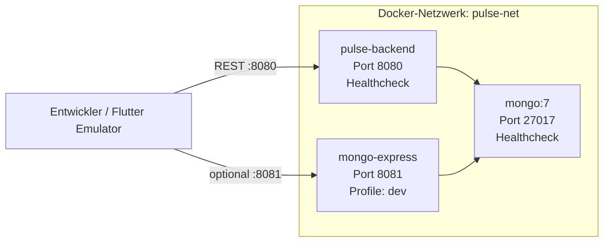

# Docker-Architektur

Pulse nutzt Docker Compose fuer lokale Backend-Services. Die Flutter-App laeuft bewusst **nicht** in Docker.

## Container-Stack



## Services

| Service | Image / Build | Port | Profil | Zweck |
|---|---|---:|---|---|
| `mongo` | `mongo:7` | 27017 | default | NoSQL-Datenbank |
| `backend` | `pulse-backend/Dockerfile` | 8080 | default | Spring Boot REST API |
| `mongo-express` | `mongo-express:latest` | 8081 | `dev` | Optionale DB-GUI |

## Healthchecks

- **MongoDB:** `mongosh` ping — Backend startet erst nach healthy Mongo
- **Backend:** `GET /actuator/health` — oeffentlicher Health-Endpoint (nur Actuator, keine Business-API)

## Profile

```bash
# Minimal: Mongo + Backend
docker compose up -d

# Mit Mongo Express DB-GUI
docker compose --profile dev up -d
```

## Volumes & Netzwerk

- **Volume:** `mongo_data` — persistente Mongo-Daten lokal
- **Netzwerk:** `pulse-net` — alle Services im gleichen isolierten Netz

## Umgebungsvariablen

| Variable | Ort | Beschreibung |
|---|---|---|
| `JWT_SECRET` | `.env` im Repo-Root | JWT-Signatur fuer Backend (min. 32 Zeichen) |
| `SPRING_DATA_MONGODB_URI` | gesetzt in Compose | Mongo-Connection im Container |

`.env.example` zeigt die erwartete lokale Konfiguration. `.env` niemals committen.

## Bewusst nicht containerisiert

| Komponente | Grund |
|---|---|
| Flutter-App | Standard: Emulator/Geraet, Hot Reload |
| Android Emulator | Gehoert nicht in Docker fuer M335 |
| Produktions-K8s | Overkill fuer Schul-MVP |

## Nuetzliche Befehle

```bash
docker compose up -d --build
docker compose ps
docker compose logs -f backend
docker compose --profile dev up -d
docker compose down
```

## Flutter → Backend

| Umgebung | URL |
|---|---|
| Host / Desktop | `http://localhost:8080` |
| Android Emulator | `http://10.0.2.2:8080` |
