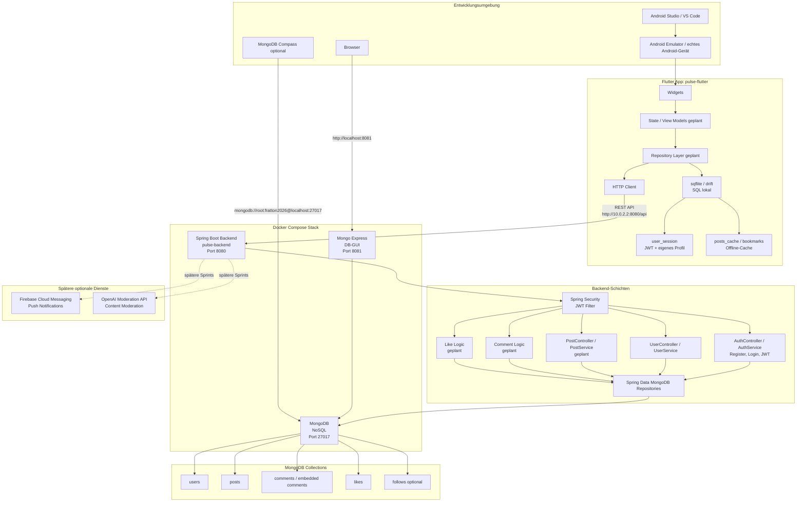

# Mermaid Architekturdiagramm

## Kurz erklärt

- Die Flutter App läuft lokal in Android Studio oder VS Code auf einem Emulator oder echten Gerät.
- Die App nutzt einen HTTP-Client, um REST Requests an das Spring Boot Backend zu senden.
- Das Spring Boot Backend läuft im Docker Compose Stack auf Port `8080`.
- MongoDB läuft ebenfalls im Docker Compose Stack auf Port `27017`.
- Mongo Express läuft auf Port `8081` und dient als einfache Web-GUI für MongoDB.
- `sqflite` oder `drift` erfüllt den lokalen SQL-Teil des Projekts.
- MongoDB erfüllt den NoSQL-Teil des Projekts.
