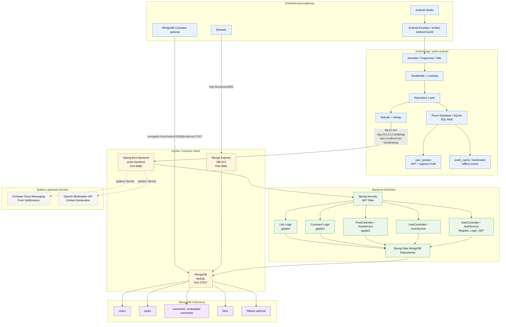

# Mermaid Architekturdiagramm

## Kurz erklärt

- Die Android App läuft lokal in Android Studio auf einem Emulator oder echten Android-Gerät.
- Die App nutzt Retrofit und OkHttp, um REST Requests an das Spring Boot Backend zu senden.
- Das Spring Boot Backend läuft im Docker Compose Stack auf Port `8080`.
- MongoDB läuft ebenfalls im Docker Compose Stack auf Port `27017`.
- Mongo Express läuft auf Port `8081` und dient als einfache Web-GUI für MongoDB.
- Room/SQLite läuft lokal auf dem Android-Gerät und erfüllt den SQL-Teil des Projekts.
- MongoDB erfüllt den NoSQL-Teil des Projekts.
- Firebase Cloud Messaging und OpenAI Moderation sind nur optionale spätere Erweiterungen.
