# Service Mermaid Diagramm

Dieses Diagramm zeigt die geplanten Services von Pulse. Die bereits vorhandenen Services sind grün markiert. Geplante Services sind grau gestrichelt.

```mermaid
flowchart TB
    APP["Android App\npulse-android\nJava"]

    subgraph BACKEND["Spring Boot Backend: pulse-backend"]
        subgraph EXISTING["Bereits vorhanden"]
            AUTH_CTRL["AuthController\nPOST /api/auth/register\nPOST /api/auth/login"]
            AUTH_SVC["AuthService"]
            JWT["JWT / Spring Security\nJwtUtil\nJwtAuthenticationFilter\nSecurityConfig"]

            USER_CTRL["UserController\nGET /api/users/me"]
            USER_SVC["UserService"]
            USER_REPO["UserRepository\nMongoRepository"]

            ERRORS["GlobalExceptionHandler\nValidation / Conflict / Unauthorized"]
        end

        subgraph PLANNED_CORE["Geplant für MVP"]
            POST_CTRL["PostController\nPOST /api/posts\nDELETE /api/posts/{id}"]
            POST_SVC["PostService"]
            FEED_CTRL["FeedController\nGET /api/feed"]
            FEED_SVC["FeedService"]
            LIKE_CTRL["LikeController\nPOST /api/posts/{id}/like\nDELETE /api/posts/{id}/like"]
            LIKE_SVC["LikeService"]
            COMMENT_CTRL["CommentController\nGET /api/posts/{id}/comments\nPOST /api/posts/{id}/comments"]
            COMMENT_SVC["CommentService"]
        end

        subgraph PLANNED_EXTRA["Optional / spätere Sprints"]
            FOLLOW_SVC["FollowService\nFollow / Unfollow"]
            CHAT_SVC["ChatService\nRealtime Chat"]
            STORY_SVC["StoryService\nStories mit Ablaufzeit"]
            EXPLORE_SVC["ExploreService\nExplore Feed"]
            MEDIA_SVC["MediaService\nBilder Upload"]
            NOTIFY_SVC["NotificationService\nPush Notifications"]
            MODERATION_SVC["ModerationService\nContent Moderation"]
        end
    end

    subgraph DATA["Datenhaltung"]
        MONGO["MongoDB\nNoSQL"]
        ROOM["Room / SQLite\nSQL lokal auf Android"]
    end

    subgraph EXTERNAL["Externe / optionale Dienste"]
        FCM["Firebase Cloud Messaging\noptional"]
        OPENAI["OpenAI Moderation API\noptional"]
    end

    APP -->|"REST API mit Retrofit"| AUTH_CTRL
    APP -->|"REST API mit Retrofit"| USER_CTRL
    APP -. "später" .-> POST_CTRL
    APP -. "später" .-> FEED_CTRL
    APP -. "später" .-> LIKE_CTRL
    APP -. "später" .-> COMMENT_CTRL

    APP --> ROOM

    AUTH_CTRL --> AUTH_SVC
    AUTH_SVC --> USER_SVC
    AUTH_SVC --> JWT

    USER_CTRL --> JWT
    USER_CTRL --> USER_SVC
    USER_SVC --> USER_REPO
    USER_REPO --> MONGO

    POST_CTRL -.-> POST_SVC
    POST_SVC -.-> MONGO
    FEED_CTRL -.-> FEED_SVC
    FEED_SVC -.-> MONGO
    LIKE_CTRL -.-> LIKE_SVC
    LIKE_SVC -.-> MONGO
    COMMENT_CTRL -.-> COMMENT_SVC
    COMMENT_SVC -.-> MONGO

    FOLLOW_SVC -.-> MONGO
    CHAT_SVC -.-> MONGO
    STORY_SVC -.-> MONGO
    EXPLORE_SVC -.-> MONGO
    MEDIA_SVC -.-> MONGO
    NOTIFY_SVC -.-> FCM
    MODERATION_SVC -.-> OPENAI

    AUTH_CTRL --> ERRORS
    USER_CTRL --> ERRORS
    POST_CTRL -.-> ERRORS
    COMMENT_CTRL -.-> ERRORS

    classDef existing fill:#d9f7d9,stroke:#208a20,stroke-width:2px,color:#111;
    classDef planned fill:#f2f2f2,stroke:#777,stroke-dasharray: 5 5,color:#111;
    classDef data fill:#e8f0ff,stroke:#3366cc,color:#111;
    classDef app fill:#fff4d6,stroke:#c28a00,color:#111;
    classDef external fill:#f8e8ff,stroke:#8a33aa,stroke-dasharray: 5 5,color:#111;

    class AUTH_CTRL,AUTH_SVC,JWT,USER_CTRL,USER_SVC,USER_REPO,ERRORS existing;
    class POST_CTRL,POST_SVC,FEED_CTRL,FEED_SVC,LIKE_CTRL,LIKE_SVC,COMMENT_CTRL,COMMENT_SVC,FOLLOW_SVC,CHAT_SVC,STORY_SVC,EXPLORE_SVC,MEDIA_SVC,NOTIFY_SVC,MODERATION_SVC planned;
    class MONGO,ROOM data;
    class APP app;
    class FCM,OPENAI external;
```

## Legende

- Grün: bereits im Backend vorhanden
- Grau gestrichelt: geplant, aber noch nicht umgesetzt
- Blau: Datenhaltung
- Gelb: Android App
- Violett gestrichelt: externe optionale Dienste

## Bereits vorhandene Backend-Services

- `AuthController`
- `AuthService`
- `JwtUtil`
- `JwtAuthenticationFilter`
- `SecurityConfig`
- `UserController`
- `UserService`
- `UserRepository`
- `GlobalExceptionHandler`

## Geplante MVP-Services

- `PostService`
- `FeedService`
- `LikeService`
- `CommentService`

## Optionale spätere Services

- `FollowService`
- `ChatService`
- `StoryService`
- `ExploreService`
- `MediaService`
- `NotificationService`
- `ModerationService`
